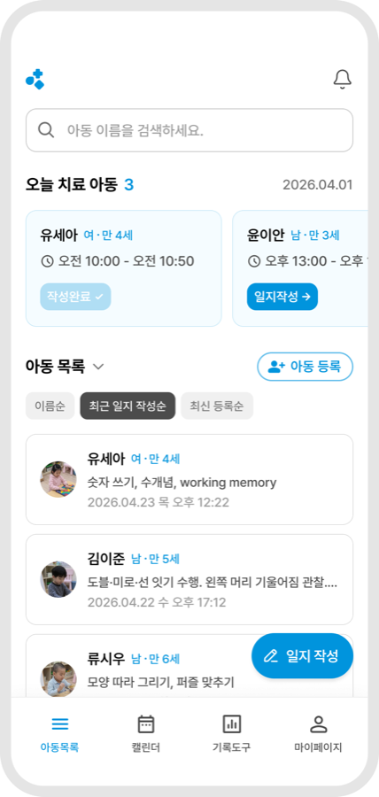
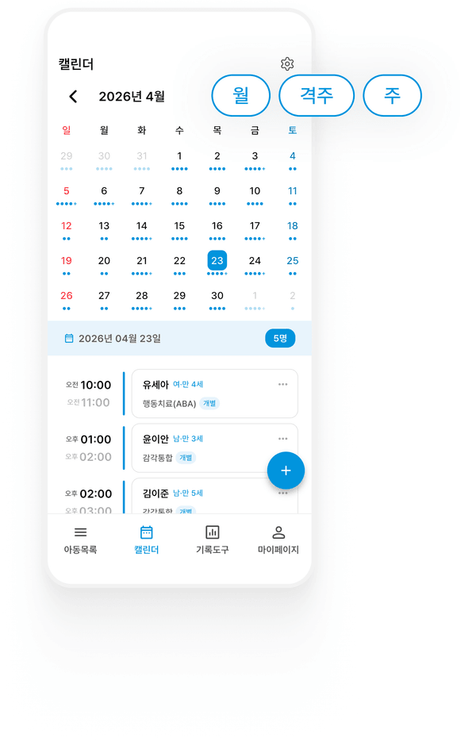
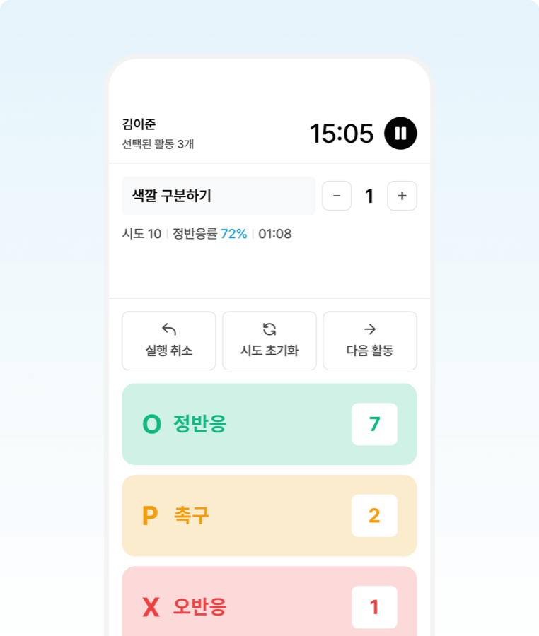
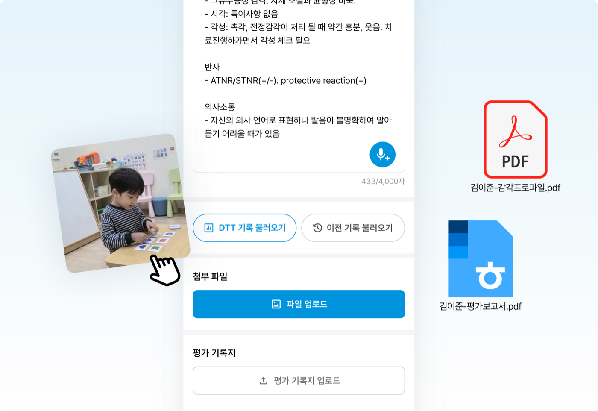
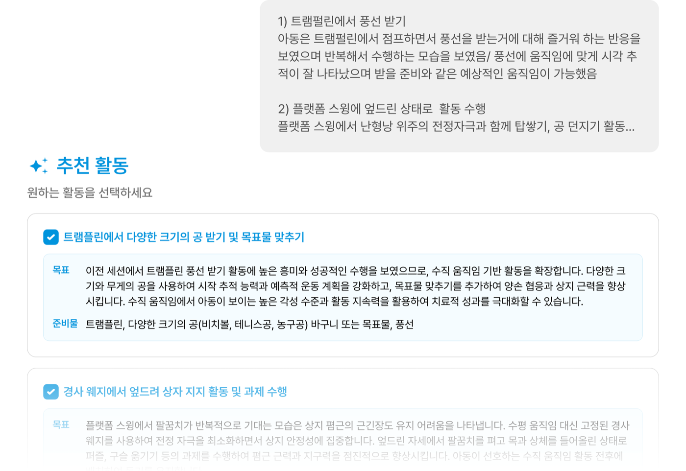
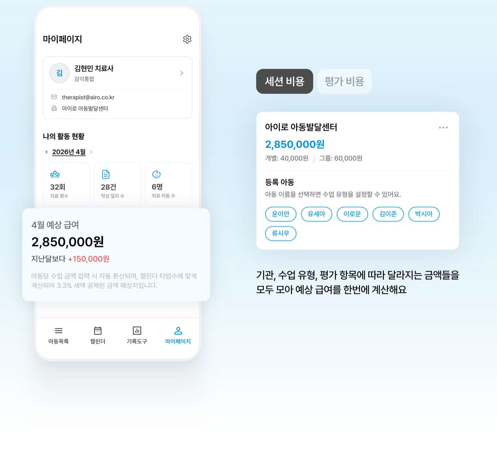

[KR](README.md) | **EN**

**Turning clinical records in developmental disability care into data**

So therapists can focus on the child, 
we bring scattered therapy records and work into one place and lighten the load with AI.

[![Try AIRO works](https://img.shields.io/badge/Try_AIRO_works-0094DD?style=for-the-badge&logo=data%3Aimage%2Fsvg%2Bxml%3Bbase64%2CPHN2ZyB3aWR0aD0iMzIiIGhlaWdodD0iMzIiIHZpZXdCb3g9IjAgMCAzMiAzMiIgZmlsbD0ibm9uZSIgeG1sbnM9Imh0dHA6Ly93d3cudzMub3JnLzIwMDAvc3ZnIj48ZyB0cmFuc2Zvcm09InRyYW5zbGF0ZSgwLjM4IC0wLjA3KSI%2BPHBhdGggZD0iTTIyLjU5MTkgMy44Njc5OEMyMi41OTE5IDQuNTQ3NzEgMjMuMTQzIDUuMDk4NzUgMjMuODIyNyA1LjA5ODc1SDI1LjIyOTZDMjUuOTA5MyA1LjA5ODc1IDI2LjQ2MDMgNS42NDk3OCAyNi40NjAzIDYuMzI5NTFWOS42NzAyNkMyNi40NjAzIDEwLjM1IDI1LjkwOTMgMTAuOTAxIDI1LjIyOTYgMTAuOTAxSDIzLjgyMjdDMjMuMTQzIDEwLjkwMSAyMi41OTE5IDExLjQ1MjEgMjIuNTkxOSAxMi4xMzE4VjEzLjUzODZDMjIuNTkxOSAxNC4yMTg0IDIyLjA0MDkgMTQuNzY5NCAyMS4zNjEyIDE0Ljc2OTRIMTguMDIxQzE3LjM0MTMgMTQuNzY5NCAxNi43OTAzIDE0LjIxODQgMTYuNzkwMyAxMy41Mzg2VjEyLjEzMThDMTYuNzkwMyAxMS40NTIxIDE2LjIzOTIgMTAuOTAxIDE1LjU1OTUgMTAuOTAxSDE0LjE1MjZDMTMuNDcyOSAxMC45MDEgMTIuOTIxOSAxMC4zNSAxMi45MjE5IDkuNjcwMjZWNi4zMjk1MUMxMi45MjE5IDUuNjQ5NzggMTMuNDcyOSA1LjA5ODc1IDE0LjE1MjYgNS4wOTg3NUgxNS41NTk1QzE2LjIzOTIgNS4wOTg3NSAxNi43OTAzIDQuNTQ3NzEgMTYuNzkwMyAzLjg2Nzk4VjIuNDYxNzNDMTYuNzkwMyAxLjc4MTk5IDE3LjM0MTMgMS4yMzA5NiAxOC4wMjEgMS4yMzA5NkgyMS4zNjEyQzIyLjA0MDkgMS4yMzA5NiAyMi41OTE5IDEuNzgxOTkgMjIuNTkxOSAyLjQ2MTczVjMuODY3OThaIiBmaWxsPSJ3aGl0ZSIvPjxwYXRoIGQ9Ik0xNC4xNTIzIDE4LjE1MzhDMTQuMTUyMyAyMS4zODI2IDExLjUzNDkgMjQgOC4zMDYxOSAyNEM1LjA3NzQ1IDI0IDIuNDYwMDMgMjEuMzgyNiAyLjQ2MDAzIDE4LjE1MzhDMi40NjAwNCAxNC45MjUxIDUuMDc3NDUgMTIuMzA3NyA4LjMwNjE5IDEyLjMwNzdMMTEuNjkwOCAxMi4zMDc3QzEzLjA1MDMgMTIuMzA3NyAxNC4xNTIzIDEzLjQwOTggMTQuMTUyMyAxNC43NjkyTDE0LjE1MjMgMTguMTUzOFoiIGZpbGw9IndoaXRlIi8%2BPHBhdGggZD0iTTIwLjAxOTUgMTcuNjk5M0MyMC45NTggMTYuNzYwOCAyMi40Nzk1IDE2Ljc2MDggMjMuNDE4IDE3LjY5OTNMMjcuODUyIDIyLjEzMzNDMjguNzkwNSAyMy4wNzE4IDI4Ljc5MDUgMjQuNTkzNCAyNy44NTIgMjUuNTMxOUwyMy40MTggMjkuOTY1OUMyMi40Nzk1IDMwLjkwNDMgMjAuOTU4IDMwLjkwNDMgMjAuMDE5NSAyOS45NjU5TDE1LjU4NTUgMjUuNTMxOEMxNC42NDcgMjQuNTkzNCAxNC42NDcgMjMuMDcxOCAxNS41ODU1IDIyLjEzMzNMMjAuMDE5NSAxNy42OTkzWiIgZmlsbD0id2hpdGUiLz48L2c%2BPC9zdmc%2B)](https://airo-works.com)

## The problem we solve

The records of developmental rehabilitation therapists — speech, occupational, cognitive, sensory integration, play therapy, and ABA — are scattered across handwritten notes, calendars mixed with memos, and forms that differ from center to center.
Journals written in bulk after work, pay tallied in spreadsheets at the end of every month, progress explained by gut feeling —
AIRO turns these records into data and gives therapists their time back for the children.

## Milestones

**2026**
- 2026.06 KODIT START-UP NEST, 19th cohort
- 2026.06 Selected for the 2026 Pre-Startup Package
- 2026.04 AIRO Inc. incorporated
- 2026.03 Open beta of AIRO works, a SaaS for therapists
- 2026.01 Selected for the Seoul Campus Town Program

**2025**
- 2025.11 Outstanding team, Pre-Startup Package incubating
- 2025.10 PIUDA Project

## Services

### AIRO WORKS

#### For therapists 

An all-in-one workspace app for therapists — iOS · Android · Web

| Feature | What it does |
|---|---|
| Therapy journal | Record sessions with photos, videos, and assessment files; pick up from the previous session's journal |
| AI journal writing | Speak and a draft appears; AI polishes it into standard terms for each therapy area — the therapist always reviews before saving |
| AI activity recommendations | Suggests activities that fit the child's current state and goals, based on past journals |
| Schedule & attendance | Day, week, and month calendars; scheduled, present, and absent check-ins; home screen widgets |
| DTT tracking | Trial-by-trial recording, with graphs of correct-response rate over time |
| Pay estimates | Monthly pay estimates that reflect rates by center, session type, assessment, and voucher |

<table>
  <tr>
    <td align="center"> Today's sessions and child list</td>
    <td align="center"> Schedule & attendance calendar</td>
    <td align="center"> DTT tracking</td>
  </tr>
  <tr>
    <td align="center"> Journals with photos and files</td>
    <td align="center"> AI activity recommendations</td>
    <td align="center"> Pay estimates by center</td>
  </tr>
</table>

All names and records in the screenshots are examples.

#### For centers 

A web console where administrators at developmental centers and similar institutions see their therapists' schedules, attendance, journal status, and settlements in one place.
It runs on the same data as AIRO works, and we are preparing a pilot with partner centers.

### Mellti 

A community where developmental rehabilitation therapists — speech, occupational, and play therapists, special education teachers, and more — shared activity materials, continuing-education info, and job listings.
The service has ended.

© AIRO Inc. · Seoul, Korea

